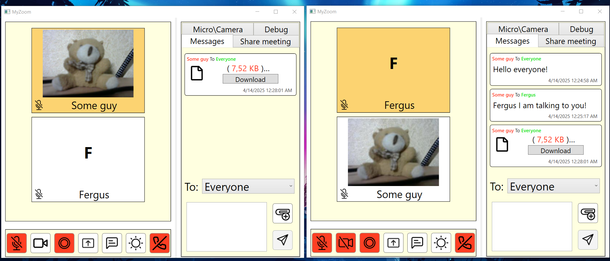
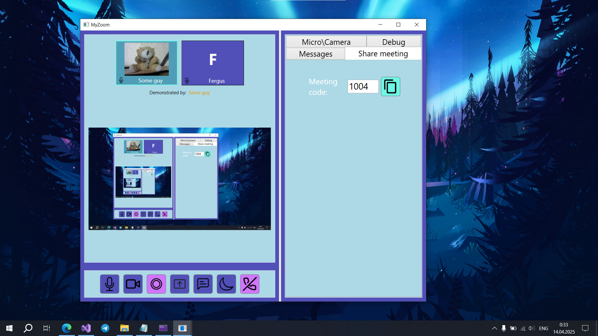

# 🎥 WPF Video Conferencing App

A **Zoom-like** video conferencing application built entirely with **.NET** and **WPF**, featuring a MVVM architecture on the client side and asynchronous UDP server on the backend.

## ✨ Features

- 📹 **Live Video & Audio Communication**  
  Real-time camera and microphone streaming between clients.

- 💬 **Integrated Chat**  
  Text chat during calls.

- 🖥️ **Screen Sharing**  
  Share your screen with other participants in real-time.

- 📁 **File Sharing**  
  Send and receive files during video sessions.

- 📼 **Video Recording** *(requires FFmpeg)*  
  Record your video sessions locally for later playback.

## 🧠 Architecture

- **Client:**  
  Built with **WPF** using the **MVVM** pattern for modular and maintainable UI logic.

- **Server:**  
  An **asynchronous console application** using **UDP** sockets and **operation codes** to communicate and manage multiple clients.

## 📷 Screenshots

  
   

  
   

